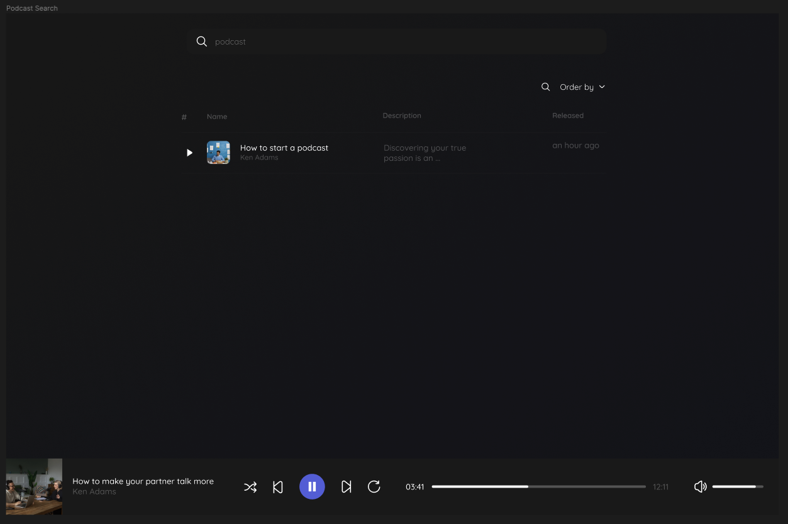
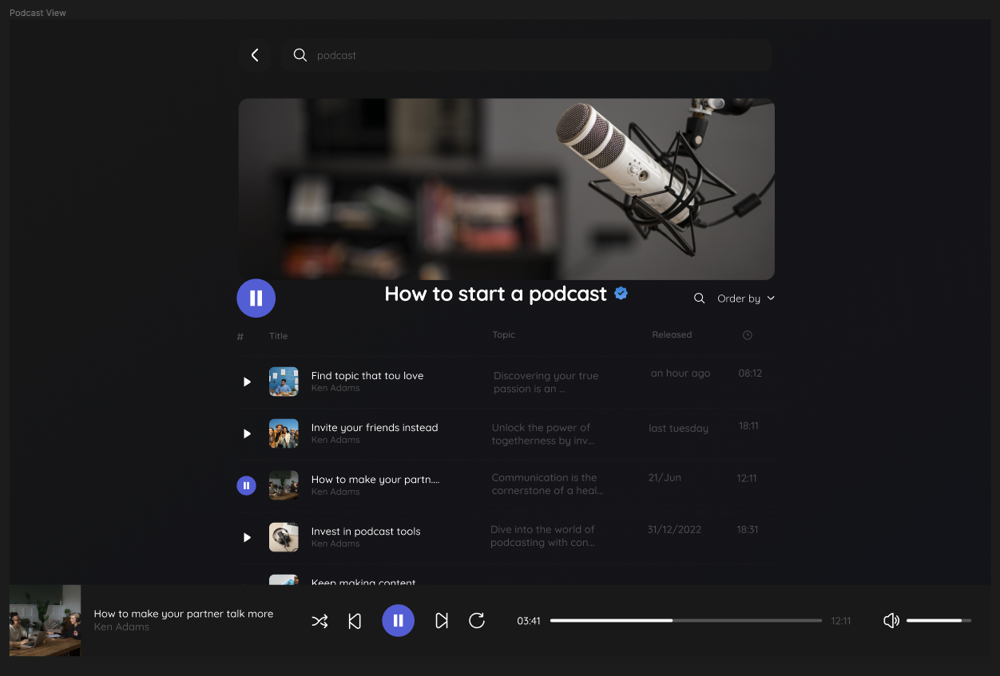

# Frontend Technical Assessment - Mini WebPlayer for iTunes podcasts

This technical assessment consists of a mini-app with a webplayer to listen to music podcasts from iTunes services.

This project was bootstrapped with [Create React App](https://github.com/facebook/create-react-app).

---

## Examples:

[Figma Design](<https://www.figma.com/file/bDI2O5GkLkOOx9Ne2khVBW/Free-Podcast-Player-Web-Design-(Community)>)

---

## Summary

- The app should has **2 views**:
  - Main view where shows a list of podcasts with a searchbar to filter them.
  - Podcast detail with a list of episodes which we can filter and order
- The 2 views shares the same layout with the mini webplayer on the bottom
- The app should follow the style guidelines defined in Figma.

### Rules

- Use create-react-app using ES2020 or TypeScript
- Use public [iTunes Search API](https://developer.apple.com/library/archive/documentation/AudioVideo/Conceptual/iTuneSearchAPI/index.html#//apple_ref/doc/uid/TP40017632-CH3-SW1) and a skip CORS with [this service](https://allorigins.win/).
- Use [TailwindCSS](https://tailwindcss.com/) and [MUI](https://mui.com/) to make reusable components.
- Extract app's styles from Figma designs.

---

## Requirements

### Layout

The two views shares the same layout.

- [ ] Should be show on top of the page the podcasts filterbar component.
- [ ] Should be show at the bottom the web player.

### Web Player

- [ ] Should start/stop/resume a selected playlist.
- [ ] Should have buttons for back to the previous episode or select the next one.
- [ ] Can select random mode, to shuffle the actual playlist.
- [ ] Can repeat the actual episode.
- [ ] Should have a volume controller.

### Main/Search view

_Assumption:_ The main view would be the search view, so `/` redirects to `/search`.
URL: `/search`

- [ ] Show the list of the 100 most popular podcasts according to this Apple's list:
      `https://itunes.apple.com/us/rss/toppodcasts/limit=100/genre=1310/json`
- [ ] The list results should be cached for 1 day to not make the API call again while cached.
- [ ] The list should be a data table with the headers Name, Description and Released.
- [ ] The "Released" field should show an human readable moment.
- [ ] The users could filter the podcast list by writing on the input search. The string should match with podcast title and/or author's name.
- [ ] The list should react immediately with the filter while typing.
- [ ] Can order the list by a chosen property from the dropdown "Order by".
- [ ] Click on a podcast should navigate to the podcast detail view.
- [ ] Can start to play podcast episodes clicking on the play button. We can stop what we are currently listen and resume it again from this button.

### Podcast detail view

URL: `/podcast/{podcastId}`

According to this endpoint:
`https://itunes.apple.com/lookup?id=934552872&media=podcast&entity=podcastEpisode&limit=20`

- [ ] Should show a banner with the podcast image.
- [ ] Under the banner should show play/pause button, the title and the "Order by" dropdown
- [ ] The podcast detail should be cached for 1 day to not make the API call again while cached.
- [ ] The list should be a data table with the headers Title, Topic, Released and Duration.
- [ ] Click on the play/pause button from an episode title should start/stop/resume the episode.

> Service for external resources that not allow JSON neither CORS headers: `https://allorigins.win`

### Episode detail

URL: `/podcast/{podcastId}/episode/{episodeId}`

- [x] Should show the same sidebar from the previous view. The podcast title and author should be links to the podcast detail view.
- [x] Should show a main section with the episode title, description and an HTML5 audio player to play the podcast. The HTML descriptions should be interpreted not escaped.

---

## Stack

Following the assestment guidelines and making some assumptions and opinions for a better DX, this is the stack for the development:

- **create-react-app**: for not using a pre-configured bundler and fine-tune this project from the start.
- **TypeScript**: a JavaScript superset to improve development experience and maintainability with types and interfaces.
- **TailwindCSS**: a CSS classes library to prototyping faster
- **Jest & React Testing Library**: for testing purpouses
- **ESLint & Prettier**: for ensuring code quality, consistency, and adherence to coding standards.
- **Husky**: for run tests, lint and format before a commit to ensure code quality.
- **React Router Dom v6**: to manage navigation

I also decided to implement a **hexagonal architecture** and **DDD** for better scalability and testable code.

---

## Instructions

### Tools & Versions

Minimal versions:

- _Node v18.X_
- _npm 9.6.7_

### Scripts

In the project directory, you can run:

### `npm start`

Runs the app in the development mode.\
Open [http://localhost:3000](http://localhost:3000) to view it in the browser.

The page will reload if you make edits.\
You will also see any lint errors in the console.

### `npm test`

Launches the test runner in the interactive watch mode.\
See the section about [running tests](https://facebook.github.io/create-react-app/docs/running-tests) for more information.

### `npm run build`

Builds the app for production to the `build` folder.\
It correctly bundles React in production mode and optimizes the build for the best performance.

The build is minified and the filenames include the hashes.\
Your app is ready to be deployed!

See the section about [deployment](https://facebook.github.io/create-react-app/docs/deployment) for more information.

### `npm run eject`

**Note: this is a one-way operation. Once you `eject`, you can’t go back!**

If you aren’t satisfied with the build tool and configuration choices, you can `eject` at any time. This command will remove the single build dependency from your project.

Instead, it will copy all the configuration files and the transitive dependencies (webpack, Babel, ESLint, etc) right into your project so you have full control over them. All of the commands except `eject` will still work, but they will point to the copied scripts so you can tweak them. At this point you’re on your own.

You don’t have to ever use `eject`. The curated feature set is suitable for small and middle deployments, and you shouldn’t feel obligated to use this feature. However we understand that this tool wouldn’t be useful if you couldn’t customize it when you are ready for it.
